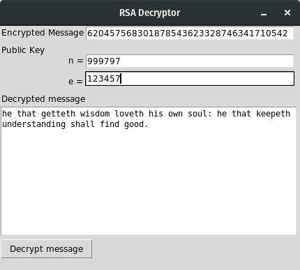

# rsa-decryption-125

An RSA decryptor.

## Description

The project decrypts messages encrypted using RSA. The character encoding for this project is a custom encoding scheme as specified in our assignment specifications. As such, this is not a general RSA decryptor. Additionally, this decryptor will take a long time to obtain the private key needed to decrypt a message from the public key, given that the public key is significantly large.

## Getting Started

### Prerequisites
We use Python 3 for this project. The project uses Python 3-specific features and syntax, making it incompatible with Python 2. This means that it won't run in Python 2. Besides, we're urged to upgrade to Python 3. New projects are asked to be developed using Python 3. As a news flash (if your are not aware), by 2020, Python 2 will no longer be supported. If you have not installed Python 3 yet, please install it before running this project.

For package management, we use `pip`. The project requirements are listed in `requirements.txt`. It is preferable that you create a virtual environment for this project before running it. This is to prevent poisoning your system libraries. We use `virtualenv` for that matter.

Installing Python 3, `pip`, and `virtualenv` may differ from system to system. It is not a requirement to install `virtualenv` for this project. However, to prevent library versioning issues with your other Python projects (if you have) and packages, we recommend installing `virtualenv`.

* [Installing in Windows (using Chocolatey)](http://docs.python-guide.org/en/latest/starting/install3/win/)    
  We recommend using [Chocolatey](https://chocolatey.org/) to install Python 3 in Windows. Chocolatey installs `pip` along with Python 3.

      C:\> choco install python
      C:\> python -m pip install -U pip
      C:\> pip install virtualenv

* [Installing in macOS (using Homebrew)](https://www.digitalocean.com/community/tutorials/how-to-install-python-3-and-set-up-a-local-programming-environment-on-macos)    
  To install Python 3 in macOS, make sure you have XCode, its Command Line Tools app, and Homebrew installed in your system. Homebrew installs `pip` alongside Python 3.

      $ brew install python3
      $ pip3 install virtualenv

* [Installing in Linux](http://docs.python-guide.org/en/latest/starting/install3/linux/)    
  The latest versions of Ubuntu, Debian, and their derivatives usually have Python 3 pre-installed. You just need to install `pip`. Make sure it is `python3-pip`. Otherwise, you'll be using `pip` for Python 2.7.
  
      $ sudo apt-get install python3-pip
      $ sudo pip3 install virtualenv
  
  If you are using an older version of Ubuntu or Debian, you might want to use the [deadsnakes PPA](https://launchpad.net/~deadsnakes/+archive/ubuntu/ppa) to install newer versions of Python.
      
  For other Linux distributions, please refer to your distribution's documentation. There's a good chance there's a tutorial out there teaching people how to install Python 3, `pip`, and `virtualenv` in your distribution. Just Google it. I can't list all Linux distros with Python 3 installation instructions here since there's a lot! And Microsoft even [added one more distro to the list](https://www.cnet.com/news/microsoft-introduces-azure-sphere-to-protect-your-iot-internet-of-things/)!. Can't we just use a single package manager for all Linux distros for the sake of the users? We could all use [Snap](https://snapcraft.io/).
* [Installing in FreeBSD](http://www.alvinsim.com/freebsd-install-python-3-and-pip/)    
  Use `portmaster` to install Python 3 in FreeBSD. `pip` will be installed alongside Python 3.

      $ sudo portmaster lang/python3
      $ sudo pip install virtualenv

  **DISCLAIMER: We have no collective experience with using FreeBSD.**
  
* For other platforms not mentioned, please open up your browser, Then, enter `http://lmgtfy.com/?q=how+to+install+Python+in+<your platform>`in the address bar, replacing `<your platform>` with the name of your operating system.

  In other words, please search Google for the instructions. Thanks! :)

### Setting It Up
#### Creating a virtual environment
At this point, we must create a `virtualenv` folder to store our virtual environment. If you choose to not use `virtualenv`, you may skip this section.

* [Creating a virtual environment in Windows](http://programwithus.com/learn-to-code/Pip-and-virtualenv-on-Windows/)    

      C:\> cd \path\to\environment\directory
      C:\> virtualenv venv

      # Activate the environment
      C:\> \path\to\venv\Scripts\activate

* Creating a virtual environment in UNIX-based OSes (e.g. Linux, macOS, FreeBSD)

      $ cd /path/to/environment/directory
      $ virtualenv venv -p /usr/bin/python3  
      # /usr/bin/python3 should be changed to the path of Python 3 in your system, if it differs.

      # Activate the environment
      $ source /path/to/venv/bin/activate

#### Cloning the repo
This part is easy. Make sure you have Git installed. Don't tell me you don't. The commands are the same for most systems, if you are using the command-line version of Git.

      $ cd /path/to/project/dir
      $ git clone https://github.com/seanballais/rsa-decryption-125.git
      $ cd rsa-decryption-125/

You may also use a GUI Git client, if you want to.

### Running the project

Before we can use the project, we must first install it. If you are using `virtualenv`, make sure you have activated your virtual environment for this project.

    $ cd /path/to/project/
    $ python3 setup.py install # or python

After installation, we can now run the project.

    $ rsa_decryption_125

## Contributing
Eyyy, not allowed yet. Sorry!

## Versioning
We use [SemVer](https://semver.org/) for versioning.

## Authors
* Sean Francis N. Ballais - [Website](https://seanballais.github.io) | [Twitter](https://twitter.com/seanballais) | [CV](https://seanballais.github.io/CV.pdf)
* Warren Kenn H. Pulma - [Twitter](https://twitter.com/pulmaats)

## License
This project is licensed under the [MIT License](LICENSE.txt).

## Acknowledgements
* Thanks to Mr. Victor M. Romero II for teaching us to RSA. Now, I am able to appreciate discrete mathematics more. -Sean *(ew, pabibo)*